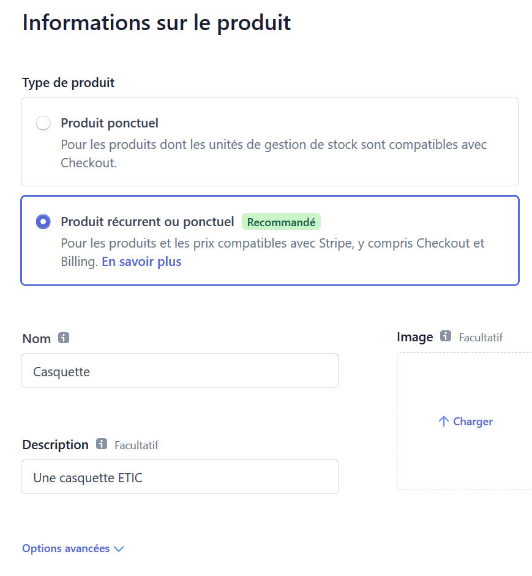
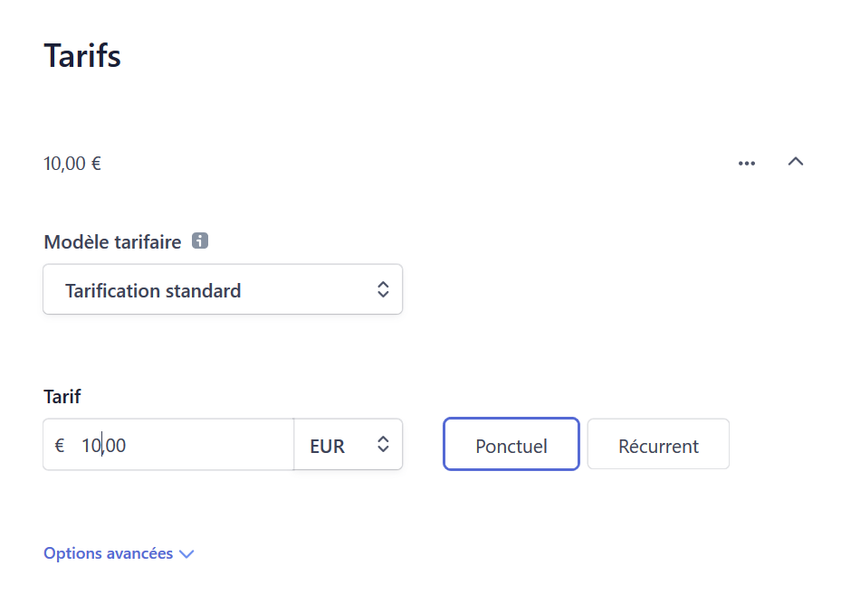
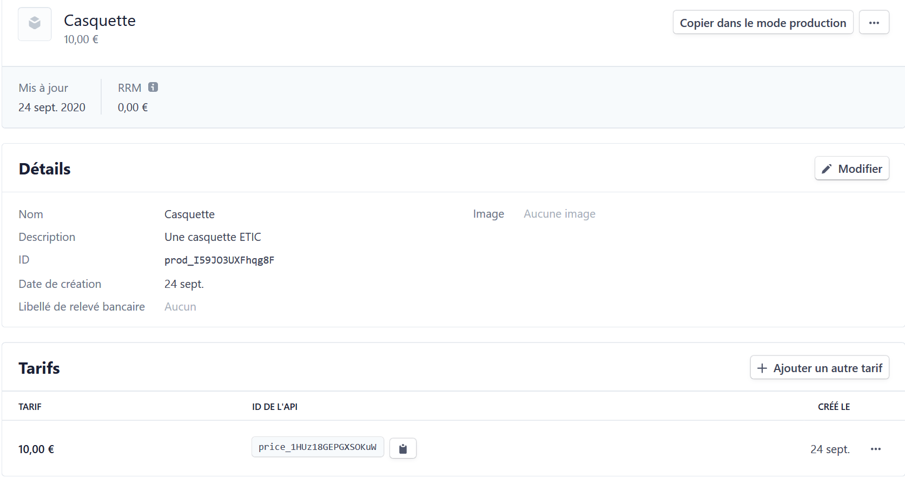
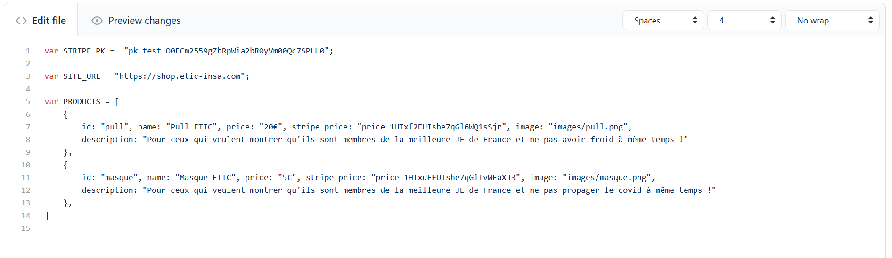
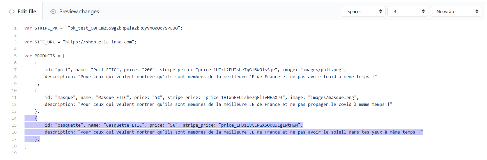

# ETIC-Shop
> A online payment portal for ETIC INSA.

ETIC-Shop is an easily configurable payment portal that is meant to work with Stripe Checkout.
[Link](https://shop.etic-insa.com/).

## Usage - Adding a new product

### Creating the product on stripe

1. Login to the stripe account. [Stripe Dashboard](https://dashboard.stripe.com/).
2. Select 'Produits' on the main menu, then 'Ajouter un produit'.
3. When creating a product select the 'Produit récurrent ou ponctuel' type.

4. Optionally, add a photo of the product here, this will be displayed on the Checkout page.
5. Fill in the other attributes, making sure to select 'Ponctuel' for the 'Tarif' section for a one-off payment. 

6. Save the product by clicking on 'Enregistrer le produit'.

### Recover the API key for product rate ('tarif')

1. Open the product page.
2. Copy the API key for the product's rate ('tarif') -> the code that starts with 'price_1HXXXXXXXXXXXXXXXX'.

### Add the new product to the site

To add a new product to the portal, you need to edit the `config.js` file.

1. Edit the `config.js` file on the master branch. The simplest way to do this is to edit the file directly on Github. Note that you might need writing rights on the repository to do this. [Edit config.js](https://github.com/ETICINSATechnologies/ETIC-Shop/edit/master/config.js)

2. Add the new product to the `PRODUCTS` table, making sure to replace all attributes, specially the price key. Make sure to respect javascript syntax ;) Syntax errors will cause the site to break (just follow the existing as example and it should be fine).

3. You can optionally add an image of the product to the site by uploading the photo into the `images` folder and then inserting the path of the image into the new entry in the `PRODUCTS` table. Follow the example of existing products. Note that for optimal viewing the image should be of size 600px X 600px.
4. Save the changes by clicking on 'Commit changes'.
5. Test that the site has been correctly updated. You might need to clear the browser cache of the page to view the new version, Ctrl + Shift + R in most browsers. [Link](https://shop.etic-insa.com/).

## Meta

Sadsitha Lokuge

[https://github.com/slokuge/](https://github.com/slokuge/)
