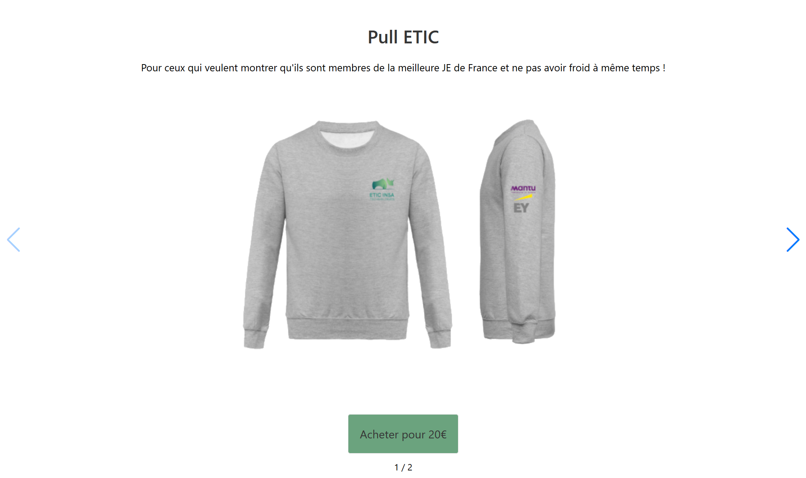

# ETIC-Shop
> A online payment portal for ETIC INSA.

ETIC-Shop is an easily configurable payment portal that is meant to work with Stripe Checkout.

## Usage example

To add a new product to the portal, you need to edit the `config.js` file.
1. Create the new product in the Stripe account and recover the price id (`price_1HXXXXXXXXXXXXXXXX`);
2. Clone the repository (<https://github.com/ETICINSATechnologies/ETIC-Shop>)
3. Edit the `config.js` file, add the new product to the PRODUCTS table, making sure to replace all attributes, specially the price id. Optionally add an image for the product.
4. Test the configuration by opening the `index.html` page in a browser and verifying that the product is present.
5. Stage and commit your changes (`git add .` `git commit -m 'Added new product'`).
6. Push to the master branch (`git push`).
7. Test in a few minutes that the portal has been correctly updated. [Link](https://shop.etic-insa.com/).

## Meta

Sadsitha Lokuge

Distributed under the GPL license.

[https://github.com/slokuge/](https://github.com/slokuge/)
